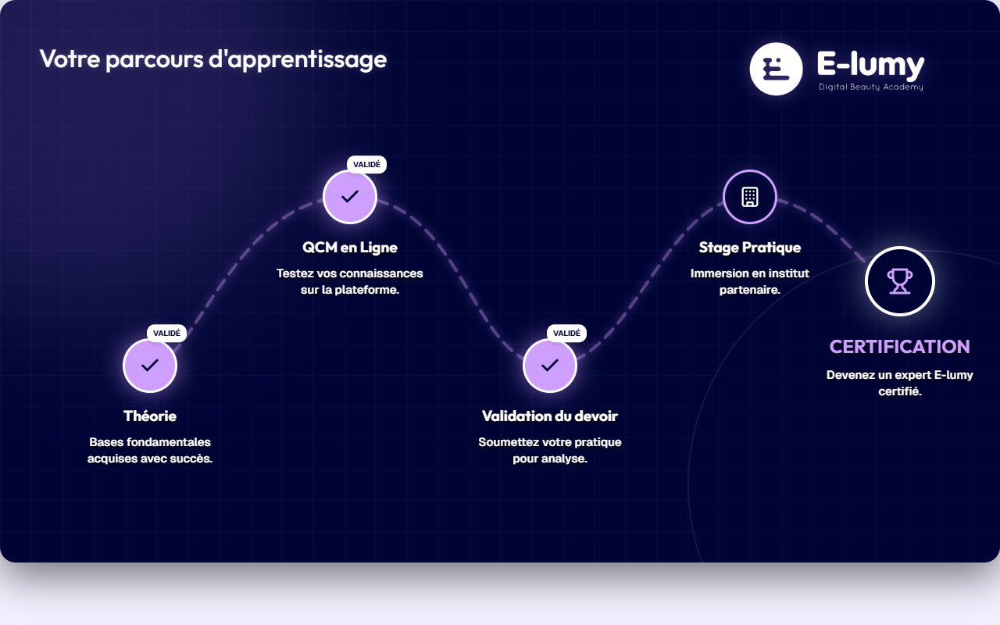

# Parcours d'Apprentissage Mannequin — Entrainement Mannequin Slide 9

**Course:** Entrainement Mannequin  
**Slide:** 9  
**Live URL:** https://parcours-apprenstissage.edtechiecorp.com  
**Stack:** Next.js · Tailwind CSS · TypeScript · GitHub Pages  

## What this slide does

Learning path overview for the mannequin training module, showing learners the structure of their practical training journey on mannequin heads before moving to real clients. At slide 9, this recap-style slide consolidates the training path completed so far and indicates what practical milestones remain. It helps learners see their overall progress within the mannequin training curriculum.

## Screenshot

## Usage

This slide is embedded as an iframe inside Coassemble at the live URL above. DNS is managed via Cloudflare (`edtechiecorp.com`). To update the slide, push to the `main` branch — GitHub Actions will rebuild and redeploy automatically.
